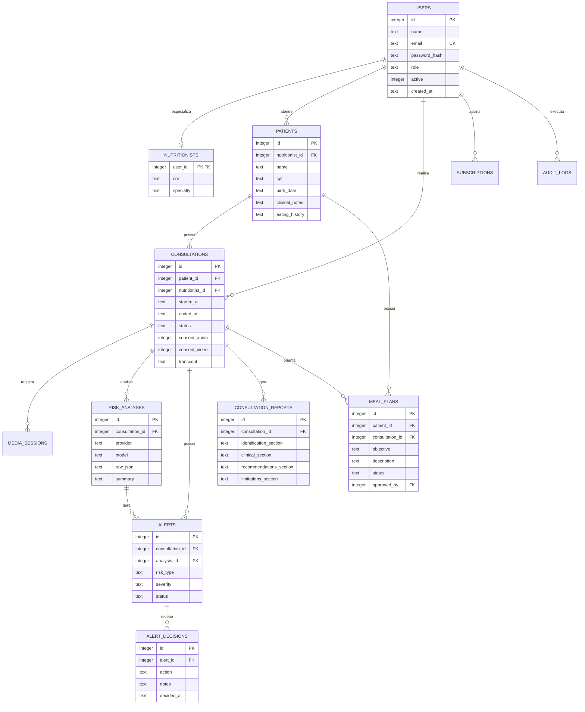

# DER Lógico

```mermaid
erDiagram
    USERS ||--o| NUTRITIONISTS : especializa
    USERS ||--o{ PATIENTS : atende
    USERS ||--o{ CONSULTATIONS : realiza
    PATIENTS ||--o{ CONSULTATIONS : possui
    CONSULTATIONS ||--o{ MEDIA_SESSIONS : registra
    CONSULTATIONS ||--o{ RISK_ANALYSES : analisa
    RISK_ANALYSES ||--o{ ALERTS : gera
    CONSULTATIONS ||--o{ ALERTS : possui
    ALERTS ||--o{ ALERT_DECISIONS : recebe
    CONSULTATIONS ||--o{ CONSULTATION_REPORTS : gera
    PATIENTS ||--o{ MEAL_PLANS : possui
    CONSULTATIONS ||--o{ MEAL_PLANS : orienta
    USERS ||--o{ SUBSCRIPTIONS : assina
    USERS ||--o{ AUDIT_LOGS : executa

    USERS {
        integer id PK
        text name
        text email UK
        text password_hash
        text role
        integer active
        text created_at
    }

    NUTRITIONISTS {
        integer user_id PK,FK
        text crn
        text specialty
    }

    PATIENTS {
        integer id PK
        integer nutritionist_id FK
        text name
        text cpf
        text birth_date
        text clinical_notes
        text eating_history
    }

    CONSULTATIONS {
        integer id PK
        integer patient_id FK
        integer nutritionist_id FK
        text started_at
        text ended_at
        text status
        integer consent_audio
        integer consent_video
        text transcript
    }

    RISK_ANALYSES {
        integer id PK
        integer consultation_id FK
        text provider
        text model
        text raw_json
        text summary
    }

    ALERTS {
        integer id PK
        integer consultation_id FK
        integer analysis_id FK
        text risk_type
        text severity
        text status
    }

    ALERT_DECISIONS {
        integer id PK
        integer alert_id FK
        text action
        text notes
        text decided_at
    }

    CONSULTATION_REPORTS {
        integer id PK
        integer consultation_id FK
        text identification_section
        text clinical_section
        text recommendations_section
        text limitations_section
    }

    MEAL_PLANS {
        integer id PK
        integer patient_id FK
        integer consultation_id FK
        text objective
        text description
        text status
        integer approved_by FK
    }
```

O script SQL de criação das tabelas está em `desktop/sql/schema.sql`.

