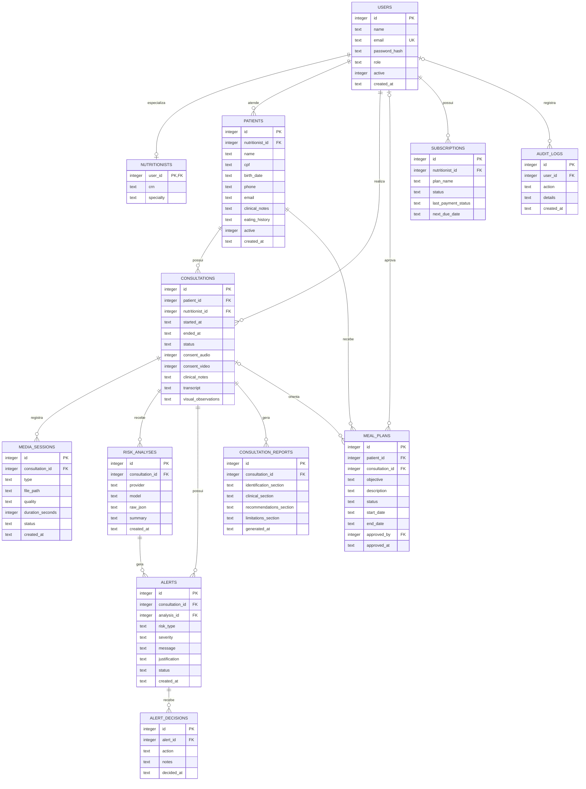

# DER Logico - Desktop Java + SQLite

Este DER representa a entrega principal do Nutrimind: aplicativo Java 17 + Swing + SQLite.

O script SQL de criacao esta em `desktop/sql/schema.sql`.

A versao web usa Supabase/PostgreSQL e foi mantida como demonstrativo publicado, mas o DER acima e o modelo usado na entrega desktop.
