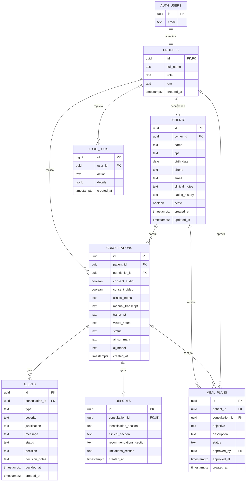

# DER Logico

Os diagramas enviados servem como base de estudo, mas nao representam exatamente a versao final do Nutrimind. Eles usam tabelas como `user`, `nutritionist` e `consultation_report`, enquanto a aplicacao publicada usa Supabase Auth e o schema real abaixo.

No projeto final, o login fica em `auth.users`, gerenciado pelo Supabase. A tabela `profiles` guarda os dados do profissional e fica ligada ao usuario autenticado pelo mesmo `id`.

## Ajustes em relacao aos diagramas enviados

- `user` foi substituida por `auth.users` + `profiles`, porque o login real e feito pelo Supabase Auth.
- `nutritionist` nao e uma tabela separada no schema web; o nutricionista e um `profile` com `role = 'NUTRITIONIST'` e campo `crn`.
- `consultation_report` foi normalizada como `reports`.
- O modelo final inclui `alerts`, `meal_plans` e `audit_logs`, que sao necessarios para o fluxo de IA, revisao profissional e rastreabilidade.
- As chaves primarias usam `uuid`, exceto `audit_logs.id`, que usa `bigint` gerado automaticamente.

O script SQL principal esta em `supabase/migrations/20260601180000_nutrimind_schema.sql`.
