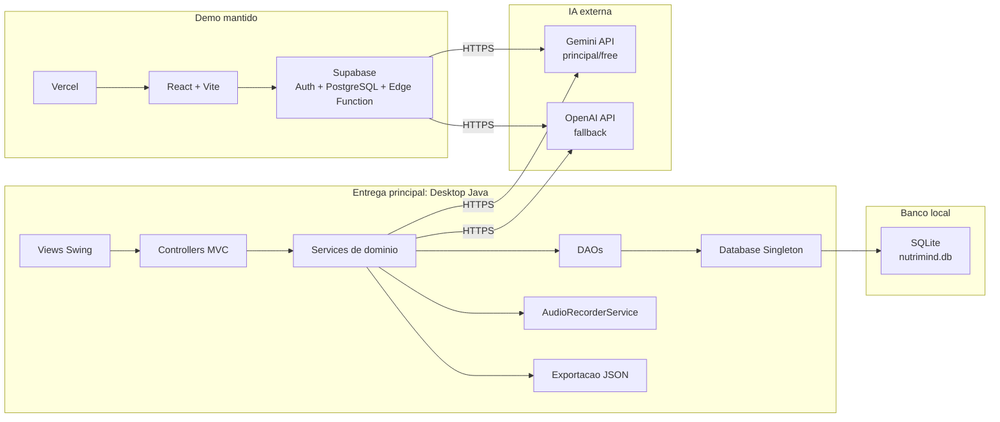

# Diagrama de Componentes

## Responsabilidades do Desktop

- **Views Swing**: telas de login, dashboard, pacientes, consulta com IA, relatorios, planos e administracao.
- **Controllers MVC**: conectam interface, servicos e persistencia.
- **Services**: regras de autenticacao, fluxo de consulta, gravacao, transcricao, analise por IA, relatorio e plano.
- **DAOs**: CRUD e consultas SQL no SQLite.
- **Database Singleton**: centraliza a conexao JDBC com `nutrimind.db`.
- **Gemini/OpenAI**: geram transcricao, resumo, riscos, recomendacoes e sugestao inicial de plano.

O web app continua no repositorio como demonstrativo, mas a arquitetura cobrada pelo PDF esta implementada no desktop.
