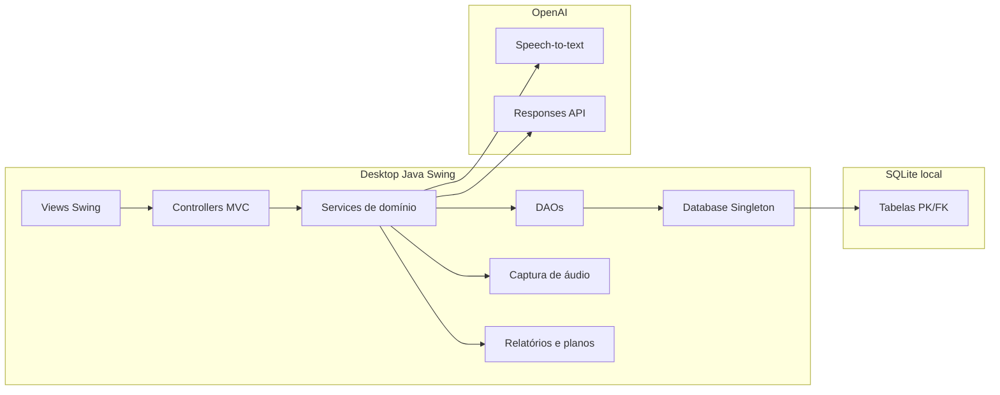

# Diagrama de Componentes

Responsabilidades:

- Views Swing: interação desktop, formulários e tabelas.
- Controllers: mediação entre tela, domínio e persistência.
- Services: autenticação, gravação, transcrição, análise por IA, relatório e regras do fluxo.
- DAOs: CRUD e consultas SQLite.
