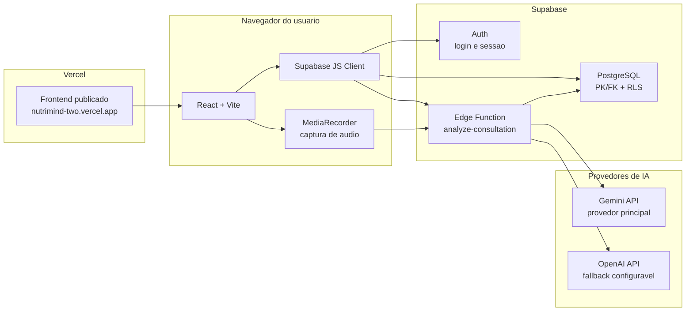

# Diagrama de Componentes

## Responsabilidades

- **React + Vite**: interface, login, pacientes, consulta, relatorios, alertas, planos e painel administrativo.
- **MediaRecorder**: grava o audio da consulta no navegador quando houver consentimento.
- **Supabase Auth**: autentica nutricionistas e administradores.
- **PostgreSQL + RLS**: guarda pacientes, consultas, alertas, relatorios, planos e auditoria com controle de acesso.
- **Edge Function**: recebe dados da consulta, audio/transcricao e contexto clinico; chama a IA e devolve JSON estruturado.
- **Gemini/OpenAI**: geram transcricao, resumo, riscos, recomendacoes e sugestao inicial de plano.

O audio bruto nao e persistido pelo fluxo principal. O sistema salva transcricao, resumo, alertas, relatorio e plano para revisao do nutricionista.
