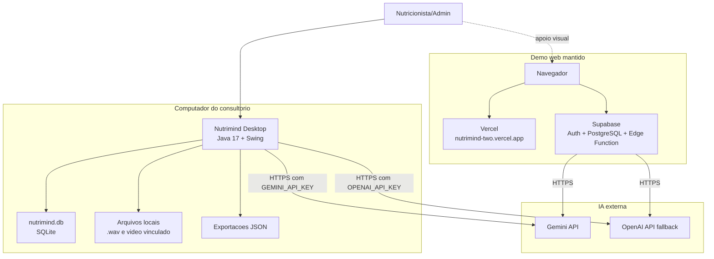

# Diagrama de Implantacao

## Fluxo implantado do Desktop

1. O usuario abre o Nutrimind Desktop no computador.
2. O sistema inicializa o SQLite local e carrega os dados de demonstracao.
3. O nutricionista registra pacientes e consultas.
4. Quando houver consentimento, o audio gravado em `.wav` pode ser enviado para transcricao por IA.
5. A analise por IA usa Gemini quando `GEMINI_API_KEY` existir; caso contrario, usa OpenAI se `OPENAI_API_KEY` existir.
6. O resultado estruturado e salvo no SQLite como analise, alertas, relatorio e plano alimentar em revisao.
7. O nutricionista toma a decisao final, registra conduta e aprova o plano.

O web app permanece publicado para apoio de apresentacao e teste visual pelo celular, mas nao altera a entrega principal Java.
