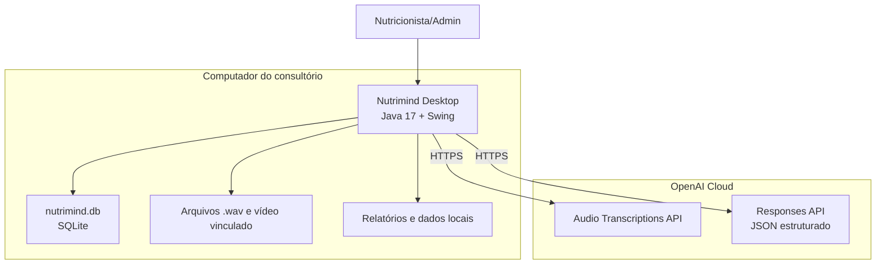

# Diagrama de Implantação

O desktop opera localmente para cadastros e histórico. A análise principal exige internet e `OPENAI_API_KEY`, pois a proposta do sistema é ser uma IA de apoio ao atendimento nutricional.
