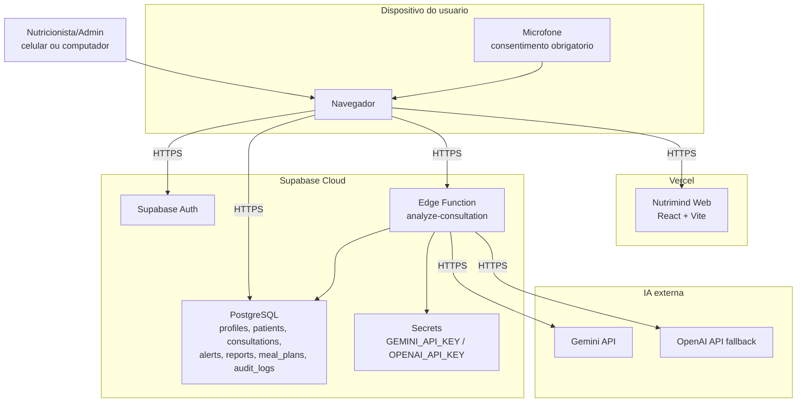

# Diagrama de Implantacao

## Fluxo implantado

1. O usuario acessa `https://nutrimind-two.vercel.app` pelo navegador.
2. A interface e carregada pela Vercel.
3. O login e validado pelo Supabase Auth.
4. Os dados do sistema sao lidos e gravados no PostgreSQL com politicas RLS.
5. Ao analisar uma consulta, o navegador envia audio/transcricao e contexto clinico para a Edge Function.
6. A Edge Function usa a chave cadastrada como segredo e chama Gemini ou OpenAI.
7. O resultado estruturado volta para o sistema e e salvo como consulta, alertas, relatorio e plano em revisao.

O desktop Java foi preservado no repositorio como implementacao legada de desenvolvimento, mas a implantacao principal do trabalho e a aplicacao web publicada.
